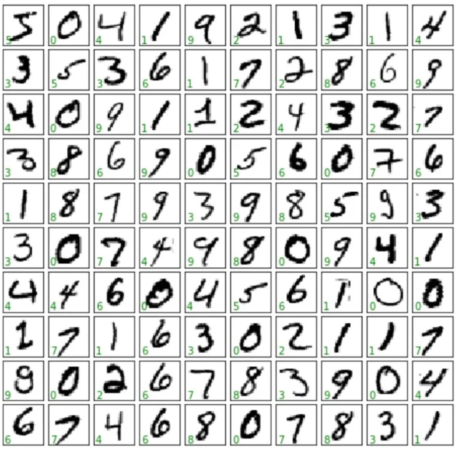
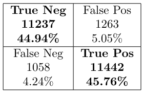

# Machine Learning Projects

## 1. Computer Vision: Number Recognition

### About

This project explores machine learning and computer vision, focusing on the recognition of numbers in images. By employing feature extraction techniques such as **Gray Scale** conversion and **Hu Moments**, this project aims to capture crucial characteristics and patterns from the input images. The algorithm of choice for this task is the **K-Nearest Neighbors (KNN)**, which enables accurate predictions by comparing the extracted features of the input image with known training examples.

* Dataset example:

 

### Results

* Accuracy: 0.947

| Nº | F1-Score |
|---|----------|
| 0 | 0.968693 |
| 1 | 0.924536 |
| 2 | 0.953176 |
| 3 | 0.947212 |
| 4 | 0.933099 |
| 5 | 0.931304 |
| 6 | 0.971694 |
| 7 | 0.917526 |
| 8 | 0.896107 |
| 9 | 0.915320 |

## 2. Rain Prediction

### About

The project focuses on estimating rainfall volume using radar data. The dataset, `rainfall-volume-jan.csv`, contains 107,136 rows of radar data captured every 15 minutes in January 2021. For this project the challenge was to deal with missing data in various ways.

* remove rows with missing data
* fill missing data with the mean of the column
* fill missing data with k-nearest neighbors
* fill missing data with the previous and next hours values

To predict the rainfall volume, the algorithm of choice was the **Decision Tree Regressor** and **Support Vector Regressor (SVR)**.

### Results

The results are presented in the Jupyter Notebook `rainfall.ipynb`.

## 3. Sentiment Analysis

### About

This project explores sentiment analysis, focusing on the classification of movie reviews as positive or negative. The datasets, `reviews.txt.csv` and `imdb_csv.zip`. To extract features from the text, the **Bag of Words** and **Word2Vec** techniques was used. 

For the classification, the algorithm **Sequence Models & Recurrent Neural Networks (RNNs)** were used to create the models. In addition to that, a few pre-trained models from **Hugging Face** were used to compare the results.

Pre-trained models used:
* yosemite/autonlp-imdb-sentiment-analysis-english-470512388
* mrm8488/t5-base-finetuned-imdb-sentiment

### Results
* Loss: 0.2394
* Accuracy: 0.9071

 